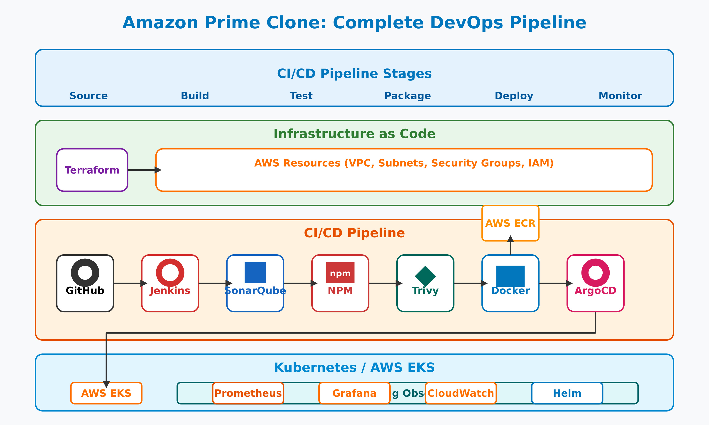
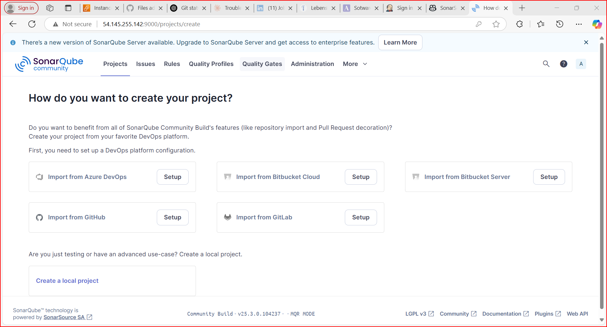
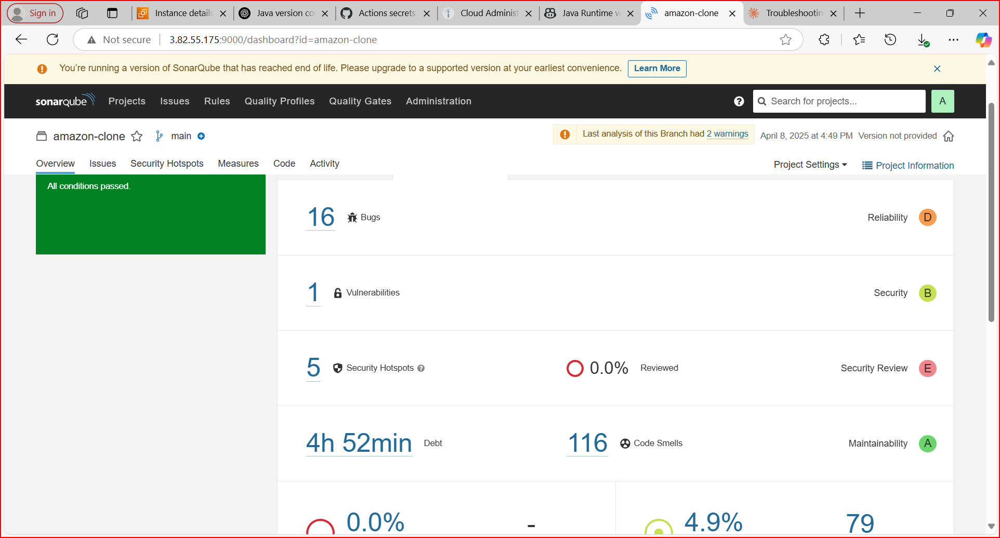
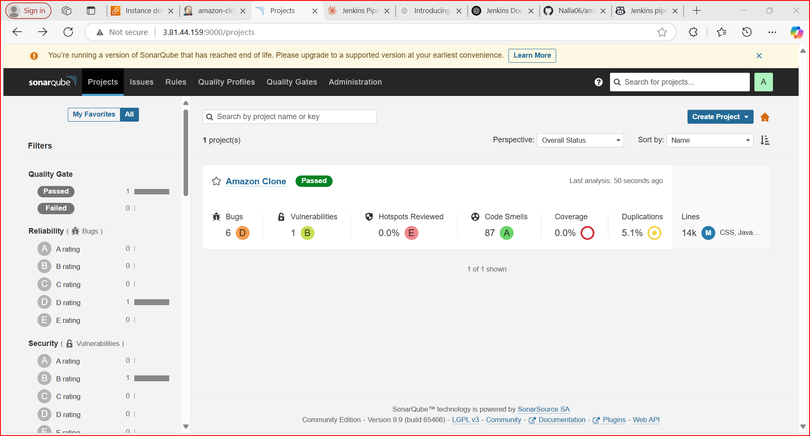
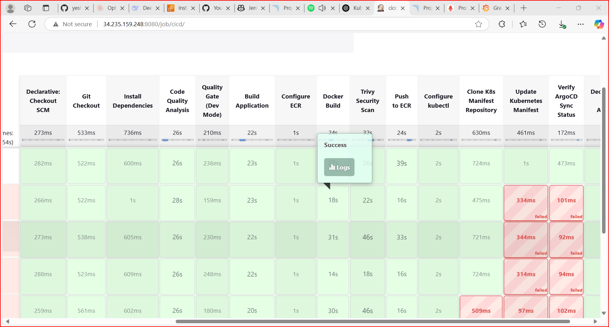
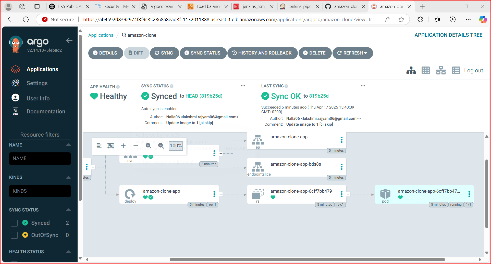
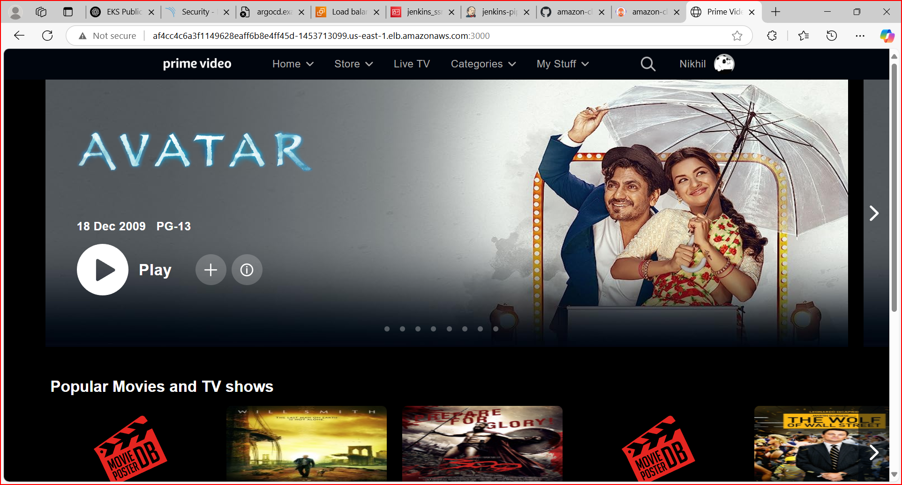

# Amazon Clone - CI/CD Pipeline with Kubernetes & ArgoCD

## End-to-End CI/CD Pipeline for an Amazon Clone Project
This project showcases a fully automated CI/CD pipeline for deploying an Amazon Clone Application using Jenkins, Docker, Kubernetes (EKS), ArgoCD, and AWS services. It also integrates monitoring, logging, and security best practices.

# Pipeline Overview
📌 Key Features
✅ Automated CI/CD Pipeline using Jenkins & ArgoCD
✅ Containerized Deployment with Docker & Kubernetes (EKS)
✅ GitOps Workflow using ArgoCD for seamless deployment
✅ Monitoring & Logging with Prometheus, Grafana, ELK Stack, Fluent Bit
✅ Secure & Scalable Infrastructure on AWS Cloud
✅ High Availability & Load Balancing with AWS ALB & Ingress Controller
# Images takes when doing this project

##  Prerequisites
To set up this CI/CD pipeline, the following tools and services were required:

## 💻 Development Tools:
1. Git – Version control
2. Docker – Containerization
3. Jenkins – CI/CD automation
4. Helm – Kubernetes package manager
## ☁️ Cloud Infrastructure:
5. AWS ECR – Private container registry

## 📊 Monitoring & Logging:
7. Prometheus & Grafana – Performance monitoring

## 2️⃣ Infrastructure Setup
🔹 CI/CD Pipeline Flow:
1️⃣ Developers push code to GitHub
2️⃣ Jenkins triggers CI/CD pipeline
3️⃣ Docker builds the image & pushes to Amazon ECR
4️⃣ ArgoCD pulls the latest image & deploys to EKS
5️⃣ Application is live on Kubernetes via ALB Ingress
6️⃣ Monitoring & logging ensure system health

## Infrastructure Setup Using Terraform
1. **Clone the Repository** 
   git clone https://github.com/yourusername/amazon-clone-cicd-argo.git
   cd amazon-clone-cicd-argo/terraform_code
2. **Initialize and Apply Terraform**:
   terraform init
   terraform apply --auto-approve

   This will create the EC2 instance, security groups, and install necessary tools like Jenkins, 
   Docker, SonarQube, etc.

## SonarQube Configuration
1. **Login Credentials**: Use `admin` for both username and password.
2. **Generate SonarQube Token**:
   - Create a token under `Administration → Security → Users → Tokens`.
   - Save the token for integration with Jenkins.

## Jenkins Configuration
1. **Add Jenkins Credentials**:
   - Add the SonarQube token, AWS access key, and secret key in `Manage Jenkins → Credentials → 
     System → Global credentials`.
2. **Install Required Plugins**:
   - Install plugins such as SonarQube Scanner, NodeJS, Docker, and Prometheus metrics under  
     `Manage Jenkins → Plugins`.

3. **Global Tool Configuration**:
   - Set up tools like JDK 17, SonarQube Scanner, NodeJS, and Docker under `Manage Jenkins → 
     Global Tool Configuration`.

## Pipeline Overview
### Pipeline Stages
1. **Git Checkout**: Clones the source code from GitHub.
2. **SonarQube Analysis**: Performs static code analysis.
3. **Quality Gate**: Ensures code quality standards.
4. **Install NPM Dependencies**: Installs NodeJS packages.
5. **Trivy Security Scan**: Scans the project for vulnerabilities.
6. **Docker Build**: Builds a Docker image for the project.
7. **Push to AWS ECR**: Tags and pushes the Docker image to ECR.
8. **Image Cleanup**: Deletes images from the Jenkins server to save space.

### Running Jenkins Pipeline
Create and run the build pipeline in Jenkins. The pipeline will build, analyze, and push the project Docker image to ECR.
Create a Jenkins pipeline by adding the following script:

### Build Pipeline

## Continuous Deployment with ArgoCD
1. **Create EKS Cluster**: Use Terraform to create an EKS cluster and related resources.
2. **Deploy Amazon Prime Clone**: Use ArgoCD to deploy the application using Kubernetes YAML files.
3. **Monitoring Setup**: Install Prometheus and Grafana using Helm charts for monitoring the Kubernetes cluster.

### Deployment Pipeline

### Cleanup Pipeline
1. Use terraform destroy to remove all AWS resources.

2. Use Kubernetes and Helm commands to clean up ArgoCD, Prometheus, and workloads.